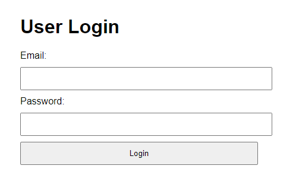

# Test Report for Web Application

### Test Environment
- **Development Tools:** VSCode
- **Browser:** Google Chrome
- **Framework:** [HTML, JavaScript, Vite]

## Test Suite: Homepage

#### Test Case 1.1: Verify Homepage Loads Correctly
**Objective:** Ensure the homepage loads without errors.
- **Input:** Navigate to the homepage URL.
- **Expected Output:** Homepage should display with two buttons: "Login" and "Register".
- **Result:** [Pass]
- **Screenshots:** 

#### Test Case 1.2: Register Button Click Navigation
**Objective:** Ensure the register button redirects to the registration form.
- **Input:** Click the "Register" button.
- **Expected Output:** Page should redirect to `registerform.html`.
- **Result:** [Pass]
- **Screenshots:** 

#### Test Case 1.3: Login Button Click Navigation
**Objective:** Ensure the login button redirects to the login form.
- **Input:** Click the "Login" button.
- **Expected Output:** Page should redirect to `login.html`.
- **Result:** [Pass]
- **Screenshots:** 

### Summary
- **Overall Success Rate:** [ 3 out of 3]
- **General Comments:** The homepage navigation buttons are functioning correctly, allowing users to access the registration and login forms as expected.

---

## Test Suite: User Registration

#### Test Case 2.1: Successful Registration
**Objective:** Verify that valid user inputs pass all validation rules and register successfully.
- **Input:** Email: "erik@example.com", Password: "ValidPass1!", Name: "Erik", Age: "25"
- **Expected Output:** All validation checks should pass, and user should be registered. Message: "Registration successful!"
- **Result:** [Pass]
- **Screenshots:** 

#### Test Case 2.2: Failed Registration - Invalid Email
**Objective:** Ensure invalid email format is detected.
- **Input:** Email: "erikexample.com"
- **Expected Output:** Email should fail validation with the message: "Email must contain the @ symbol."
- **Result:** [Pass]
- **Screenshots:** 

#### Test Case 2.3: Failed Registration - Weak Password
**Objective:** Ensure a weak password fails validation.
- **Input:** Password: "pass"
- **Expected Output:** Password fails validation with the message: "Password must be at least eight characters long."
- **Result:** [Pass]
- **Screenshots:** 

#### Test Case 2.4: Failed Registration - Invalid Name
**Objective:** Ensure invalid names are detected.
- **Input:** Name: "Erik!@#"
- **Expected Output:** Name should fail validation with the message: "Name cannot include special characters."
- **Result:** [Pass]
- **Screenshots:** 

#### Test Case 2.5: Failed Registration - Invalid Age
**Objective:** Ensure age validation detects letters in the input.
- **Input:** Age: "25a"
- **Expected Output:** Age fails validation with the message: "Age cannot include letters."
- **Result:** [Pass]
- **Screenshots:** 

### Summary
- **Overall Success Rate:** [ 5 out of 5]
- **General Comments:** The registration form is functioning as expected, including validation for email, password, name, and age fields. All test cases passed.

---

## Test Suite: User Login

#### Test Case 3.1: Successful Login
**Objective:** Verify that valid credentials allow the user to log in.
- **Input:** Enter valid credentials (email and password) matching those in local storage.
- **Expected Output:** User should log in successfully and be redirected to the user page. Message: "Login successful!"
- **Result:** [Pass]
- **Screenshots:** 

#### Test Case 3.2: Failed Login - Incorrect Password
**Objective:** Ensure the system detects incorrect passwords.
- **Input:** Enter correct email but incorrect password.
- **Expected Output:** Login fails with the message: "Invalid email or password."
- **Result:** [Pass]
- **Screenshots:** 

#### Test Case 3.3: Failed Login - Unregistered Email
**Objective:** Ensure the system detects unregistered email addresses.
- **Input:** Enter an email not present in local storage.
- **Expected Output:** Login fails with the message: "Invalid email or password."
- **Result:** [Pass]
- **Screenshots:** 

### Summary
- **Overall Success Rate:** [ 3 out of 3]
- **General Comments:** The login system correctly identifies valid and invalid credentials, providing appropriate feedback to the user.

---

## Test Suite: To-Do List

#### Test Case 4.1: Add Task
**Objective:** Verify that tasks can be added to the to-do list.
- **Input:** Enter a task in the input field and click "Add Task".
- **Expected Output:** Task should be added to the to-do list and displayed.
- **Result:** [Pass]
- **Screenshots:** 

#### Test Case 4.2: Edit Task
**Objective:** Verify that tasks can be edited.
- **Input:** Click the "Edit" button next to a task, modify the task, and save changes.
- **Expected Output:** The task should be updated in the list.
- **Result:** [Pass]
- **Screenshots:** 

#### Test Case 4.3: Delete Task
**Objective:** Verify that tasks can be deleted.
- **Input:** Click the "Delete" button next to a task.
- **Expected Output:** Task should be removed from the list.
- **Result:** [Pass]
- **Screenshots:** 

#### Test Case 4.4: Save Tasks to Local Storage
**Objective:** Verify that tasks are saved to local storage.
- **Input:** Add a task and reload the page.
- **Expected Output:** The task should still be present in the to-do list after page reload.
- **Result:** [Pass]
- **Screenshots:** 

#### Test Case 4.5: Edit and Save Task to Local Storage
**Objective:** Verify that edited tasks are updated in local storage.
- **Input:** Edit an existing task and reload the page.
- **Expected Output:** The edited task should still be present with the changes after page reload.
- **Result:** [Pass]
- **Screenshots:** 

#### Test Case 4.6: Delete Task from Local Storage
**Objective:** Verify that deleted tasks are removed from local storage.
- **Input:** Delete a task and reload the page.
- **Expected Output:** The task should no longer appear in the list after page reload.
- **Result:** [Pass]
- **Screenshots:** 

### Summary
- **Overall Success Rate:** [ 6 out of 6]
- **General Comments:** The to-do list functionality works as expected, including adding, editing, deleting tasks, and persisting tasks through local storage.

---

### Final Summary
- **Overall Success Rate for Entire System:** [ 17 out of 17]
- **General Comments:** All functionalities of the web application passed the manual cases, including homepage navigation, user registration, login, and the to-do list with local storage integration.
