# Test Report for Validator Module

### Test Environment
- **Development Tools:** VSCode
- **Browser:** Google Chrome
- **Framework:** [HTML, JavaScript, Vite]

## Test Suite: Password Validation

#### Test Case 1.1: Successful Password Validation
**Objective:** Verify that a valid password passes all validation rules.
- **Input:** Enter password: "ValidPass1!"
- **Expected Output:** Password passes all validation checks (minimum length, includes a number, uppercase, lowercase, and special character). Message: "Password is valid".
- **Result:** [Pass]
- **Screenshots:** 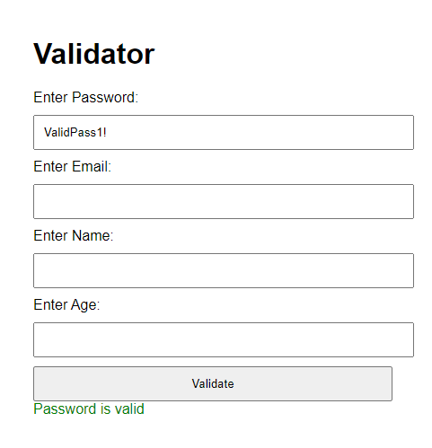

#### Test Case 1.2: Failed Validation - Password Too Short
**Objective:** Ensure the system detects passwords that are too short.
- **Input:** Enter password: "Pass1!"
- **Expected Output:** Password fails the length check (less than 8 characters). Message: "Password must be at least eight characters long"
- **Result:** [Pass]
- **Screenshots:** 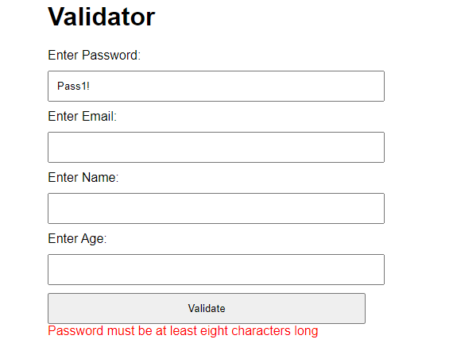

#### Test Case 1.3: Failed Validation - No Number
**Objective:** Ensure the system detects passwords without a number.
- **Input:** Enter password: "Password!"
- **Expected Output:** Password fails the number check. Message: "The password must contain at least one number"
- **Result:** [Pass]
- **Screenshots:** 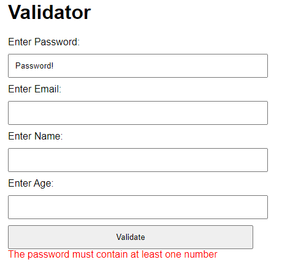

#### Test Case 1.4: Failed Validation - No Uppercase Letter
**Objective:** Ensure the system detects passwords without an uppercase letter.
- **Input:** Enter password: "password1!"
- **Expected Output:** Password fails the uppercase letter check. Message: "The password must contain at least one uppercase letter"
- **Result:** [Pass]
- **Screenshots:** 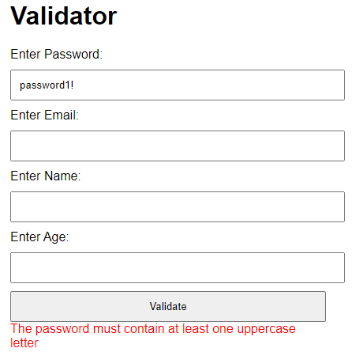

#### Test Case 1.5: Failed Validation - No Lowercase Letter
**Objective:** Ensure the system detects passwords without a lowercase letter.
- **Input:** Enter password: "PASSWORD1!"
- **Expected Output:** Password fails the lowercase letter check. Message: "The password must contain at least one lowercase letter"
- **Result:** [Pass]
- **Screenshots:** 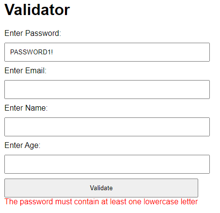

#### Test Case 1.6: Failed Validation - No Special Character
**Objective:** Ensure the system detects passwords without a special character.
- **Input:** Enter password: "Password1"
- **Expected Output:** Password fails the special character check. Message: "The password must contain at least one special character"
- **Result:** [Pass]
- **Screenshots:** 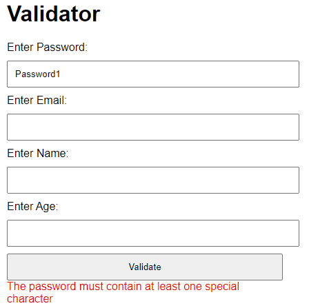

#### Test Case 1.7: Failed Validation - Dangerous Characters
**Objective:** Ensure the system detects passwords that contain dangerous characters.
- **Input:** Enter password: "Password1<>"
- **Expected Output:** Password fails the dangerous characters check. Message: "Password contains the following dangerous characters: <, >"
- **Result:** [Pass]
- **Screenshots:** 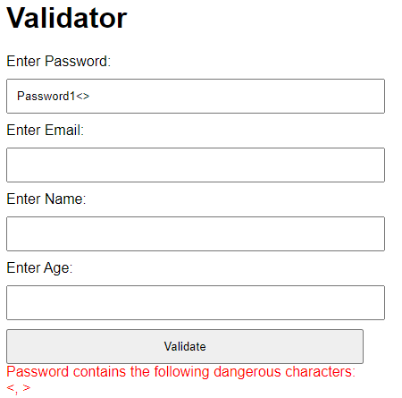

### Summary
- **Overall Success Rate:** [ 7 out of 7]
- **General Comments:** The password validation rules are working as expected. All test cases passed.

## Test Suite: Email Validation

#### Test Case 2.1: Successful Email Validation
**Objective:** Verify that a valid email passes the validation rules.
- **Input:** Enter email: "erik@example.com"
- **Expected Output:**  Email passes the validation checks for "@" and "." symbols. Message: "Email is valid"
- **Result:** [Pass]
- **Screenshots:** 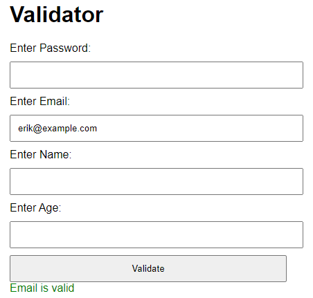

#### Test Case 2.2: Failed Validation - Missing "@" Symbol
**Objective:** Ensure the system detects missing "@" in the email.
- **Input:** Enter email: "erikexample.com"
- **Expected Output:** Email fails the "@" symbol check. Message: "Email must contain the @ symbol"
- **Result:** [Pass]
- **Screenshots:** 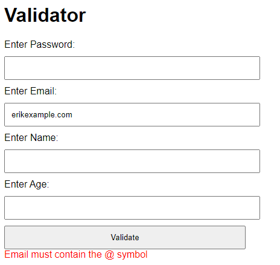

#### Test Case 2.3: Failed Validation - Missing "." Symbol
**Objective:** Ensure the system detects missing "." in the email.
- **Input:** Enter email: "erik@examplecom"
- **Expected Output:** Email fails the "." symbol check. Message: "Email must contain the . symbol"
- **Result:** [Pass]
- **Screenshots:** 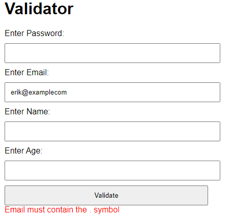

### Summary
- **Overall Success Rate:** [ 3 out of 3]
- **General Comments:** The email validation rules are working as expected. All test cases passed, including edge cases such as missing "@" and ".".

## Test Suite: Name Validation

#### Test Case 3.1: Successful Name Validation
**Objective:** Verify that a valid name passes the validation rules.
- **Input:** Enter name: "Erik"
- **Expected Output:**  Name passes the validation checks (minimum length, no numbers, no special characters). Message: "Name is valid"
- **Result:** [Pass]
- **Screenshots:** 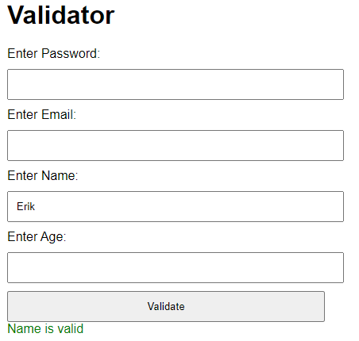

#### Test Case 3.2: Failed Validation - Name Too Short
**Objective:** Ensure the system detects when the name is too short.
- **Input:** Enter name: "E"
- **Expected Output:** Name fails the length check (less than 2 characters). Message: "Name is too short"
- **Result:** [Pass]
- **Screenshots:** 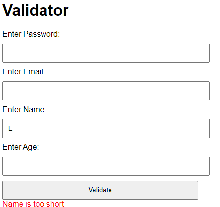

#### Test Case 3.3: Failed Validation - Name Contains Number
**Objective:** Ensure the system detects numbers in the name.
- **Input:** Enter name: "Erik123"
- **Expected Output:** Name fails the number check. Message: "Name cannot include numbers"
- **Result:** [Pass]
- **Screenshots:** 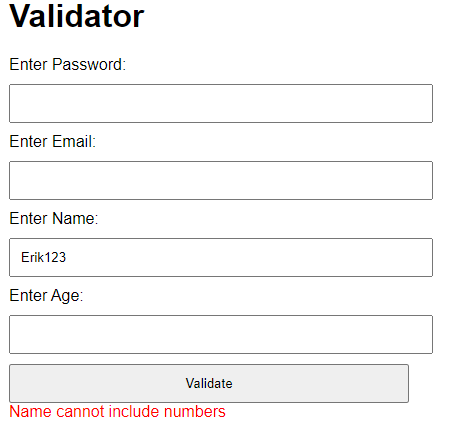

#### Test Case 3.4: Failed Validation - Name Contains Special Character
**Objective:** Ensure the system detects special characters in the name.
- **Input:** Enter name: "Erik!@#"
- **Expected Output:**  Name fails the special character check. Message: "Name cannot include special characters"
- **Result:** [Pass]
- **Screenshots:** 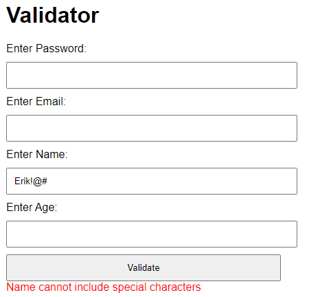

### Summary
- **Overall Success Rate:** [ 4 out of 4]
- **General Comments:** The name validation rules are functioning as expected, catching both character and length violations.

## Test Suite: Age Validation

#### Test Case 4.1: Successful Age Validation
**Objective:** Verify that a valid age passes the validation rules.
- **Input:** Enter age: "25"
- **Expected Output:**  Age passes all validation checks (only numbers, no letters, max three digits). Message: "Age is valid"
- **Result:** [Pass]
- **Screenshots:** 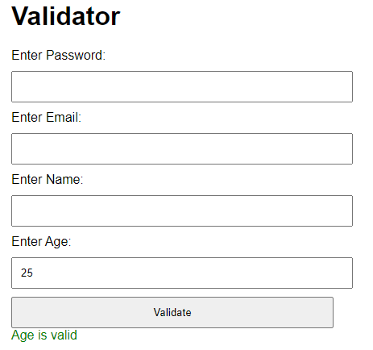

#### Test Case 4.2: Failed Validation - Age Contains Letters
**Objective:** Ensure the system detects letters in the age input.
- **Input:** Enter age: "25a"
- **Expected Output:** Age fails the check for letters. Message: "Age cannot include letters"
- **Result:** [Pass]
- **Screenshots:** 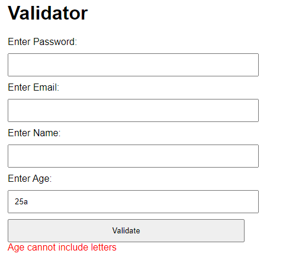

#### Test Case 4.3: Failed Validation - Age Contains No Numbers
**Objective:** Ensure the system detects when there are no numbers in the input.
- **Input:** Enter age: "abc"
- **Expected Output:** Age fails the check for numbers. Message: "Age must include at least one number"
- **Result:** [Pass]
- **Screenshots:** 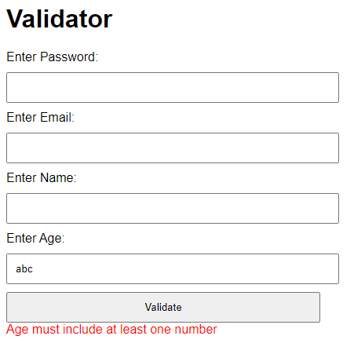

#### Test Case 4.4: Failed Validation - Age Contains More Than Three Digits
**Objective:** Ensure the system detects when the age input has more than three digits.
- **Input:** Enter age: "1234"
- **Expected Output:**  Age fails the length check. Message: "Age cannot contain more than three numbers"
- **Screenshots:** 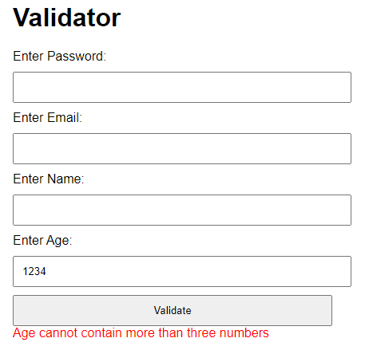

### Summary
- **Overall Success Rate:** [ 4 out of 4]
- **General Comments:** The age validation rules are working as expected. All test cases passed, including edge cases such as invalid letters and excessive digits in the input.