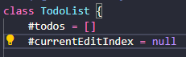

# Reflektion kapitel 4-11 (L3)

## Kapitel 4 Comments
### Redundant comments
I min userpage.js upptäckte jag att jag har överflödiga kommetarer. Dessa kommentarer ökar egentligen inte tydligheten och anses därför vara onödiga. Koden för metoderna och variablerna är egentligen självförklarande och bara genom att läsa koden förstår man relativt lätt vad den gör. Jag har därför valt att ta bort dessa kommentarer och göra koden renare och mer lättläst. 

## Kapitel 5 Formatting
Jag tycker att jag följer de flesta reglerna/rekommendatinerna för för formatting i min kod bra. Jag separerar olika concept genom "vertical openness between concepts" genom radbrytningar för att öka läsbarheten. Jag implementerar "Horizontal Openness and Density" för att öka tydlighet och understryka stark association inom koden utan att ha mellanslag. Generellt sätt känns det som att vi har arbetat medvetet/undermedvetet med formatting från första början när vi började koda, vilket har gjort att mycket av det som beskrivs i detta kapitel nästan känns "standard". 
### Indentation
I min registerform.js har jag dock upptäckt att jag lite väl mycket identering inuti metoden. Jag har därför valt att ändra och minska identeringen för att göra koden mer kompakt. 

## Kapitel 6 Objects and Data Structures
När jag kollar igenom min kod så märker jag att jag har ganska många publika metoder. För att följa "Law of Demeter" borde jag försöka kaplsa in mina metoder mer inom klasserna och bara exponera de metoder som verkligen behöver användas av andra klasser i mitt projekt. Detta gör att den interna logiken inom klasserna döljs från användaren och det finns mindre risk att något "går sönder" eller att man råkar introducera öonskade effekter på existerande klasser/objekt i framtiden om man skulle vidareutveckla koden.

Jag har dock försökt att dölja några av de viktigaste metoderna inom min PasswordValidator.js genom att göra dem privata.

## Kapitel 7 Error Handling
I alla mina valideringsklasser från Module-L2 använder jag try-catch block inom validate() metoden för att fånga upp fel. Det jag inte följer så bra är "Use Unchecked Exceptions" och "Provide Context with Exceptions". Istället returnerar metoden ett felmeddelande. Detta kan vara fördelaktivt när det gäller att ge användaren feedback om vad som gått fel men beskriver ingen mer detaljerad kontext angående felet. Det kan därför vara svårare att hantera felet på ett mer komplext och djupare plan om syftet är robust felhantering. Metoden återger heller inte specifik detaljerad information om vilken "regel" som gav upphov till felet eller vilket fält eller input value som gav upphov till felet. Men min applikation är såpass simpel att jag inte behöver någon jätte robust felhantering utan userfeedback vid registrering är viktigare i detta fall.

## Kapitel 8 Boundaries
### Using third-party code
I detta projekt kan man teoretiskt se min Modul från L2 som kod från "third-party". Den är modulär, fungerar självständigt och innehåller egna tester. Testerna består av manuella tester vilket användaren av modulen kan starta upp och använda mot ett user interface. Detta ger tydlig och snabb feedback om hur modulen fungerar och användaren kan fokusera på att testa den istället för att spendera massa tid på att läsa dokumentation (Learning Tests Are Better Than Free) (Exploring and Learning Boundaries).

## Kapitel 9 Unit Tests
Jag har sedan förra projektet, utökat testerna i min Modul-L2 från att bara ha manuella tester till att också inkludera unit tests. Jag har dock inte följt "The Three Laws of TDD" då jag skrev alla unit testerna i efterhand. Testerna följer dock regeln One Assert per test och F.I.R.S.T principerna. Varje enskilt test utför endast en sak. Testerna är snabba, de kan köras enskilt, kan repeteras, har en boolean output (pass/fail). Dock har jag inte följt den sista "Timely" aspekten inom F.I.R.S.T då testerna är skapade efter koden skapades. 

## Kapitel 10 Classes
Jag har försökt att hålla mina klasser så små och kompakta som möjligt för att utföra den specifika uppgiften (Classes Should be Small). Alla mina valideringsklasser följer principet "Single Responsibility Principle" (SRP) då de enbart gör en sak, nämligen validerar ett specifikt inmatat värde. Den största klassen jag har är min todolist.js. Den följer SRP till viss del genom att fokusera på crud-funktioner för todo-listan. Den innehåller dock annan logik också, såsom "displayTodos(). Enligt SRP så skulle denna funktion bryts ut till en enskild klass. Detta gör också att klassen hade blivit mindre. Jag har dock gjort #todos och #currentEditIndex privata och inför inkapsling. 

## Kapitel 11 Systems
För närvarande separerar jag inte konstruktion och användning av systemet så bra. Min kod gör både konstruktion och användning av objekten inom samma logik. Till exempel i min todolist.js så skapas alla beroenden direkt inom klassen och används direkt för att hantera data och spara dem. Den skapar även UI-relaterade delar och händelsehanterare direkt i klassen som en del av logiken. Enligt Dependency Injection regeln borde min todolist.js inte ansvara själv för att instansiera objekt som den är beroende av, exemvis sparandet till local storage. Istället för detta borde detta beroendet injiceras från en central plats som hanterar all instansiering. 

